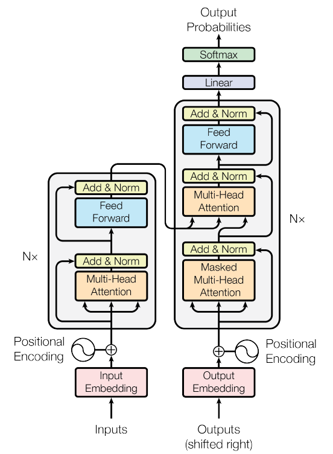
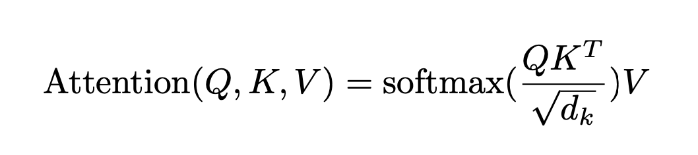
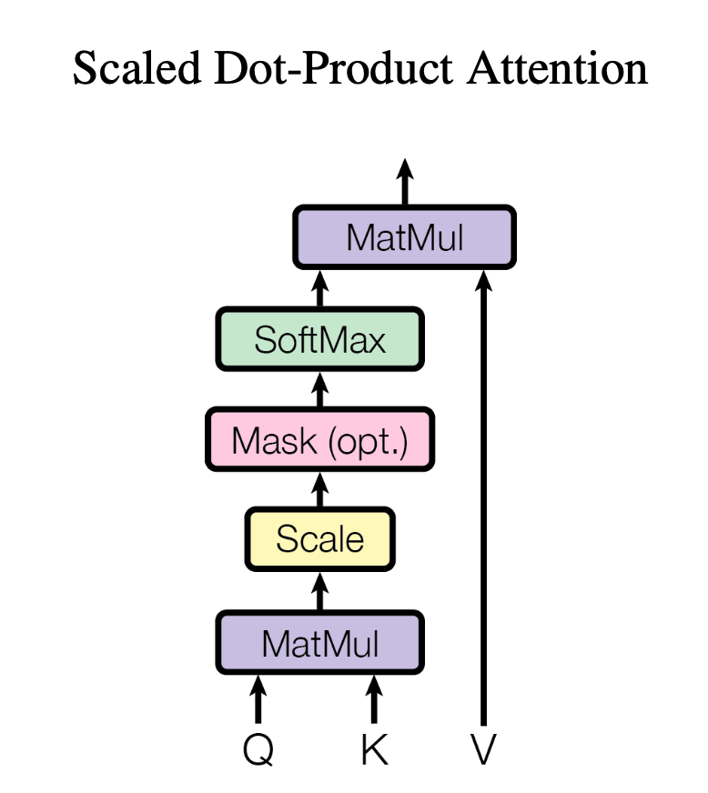
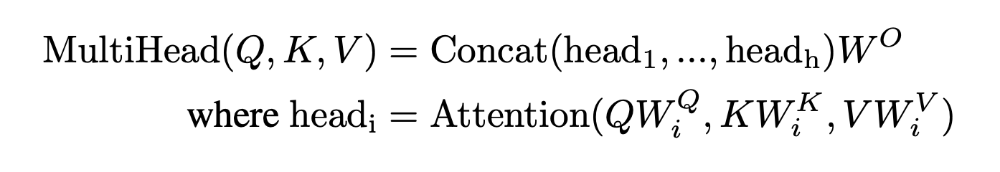
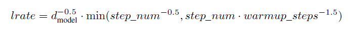
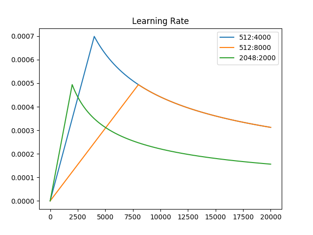
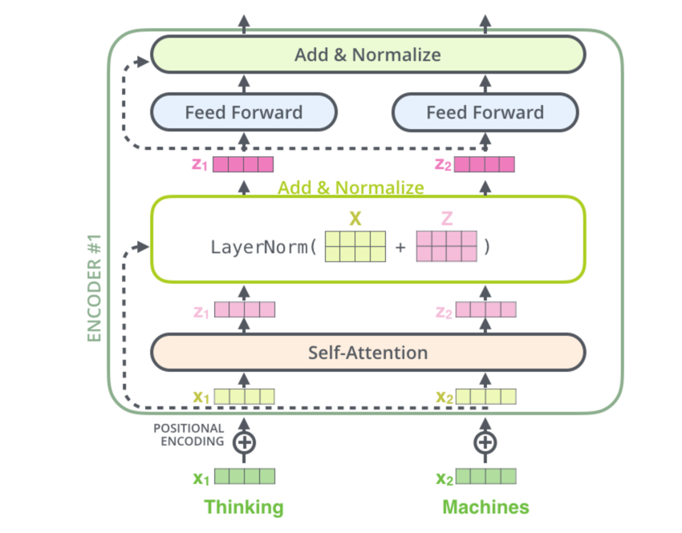
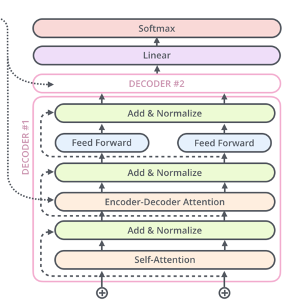

# Transformer

This repository contains my implementation of the transformer architecture proposed in the seminal paper "Attention is all you need" [Vaswani et al.](https://arxiv.org/abs/1706.03762)

## Supporting material
In this video, I walk through the paper and explain the overall transformer architecture.

[](https://youtu.be/DYqAetygUTE)

I ended up making a two more videos where I talk about **Attention mechanism** in detail:
* [Deep dive into Attention mechanism of a Transformer](https://youtu.be/rbQmveWqu-s?si=KPxJnguqnysdpuT8)
* [Implementing Multihead Attention in a Transformer](https://youtu.be/IvPbb4ulRuA?si=tNQVUmaiM7cDD_3h)

And here are my study notes on **Attention** in form of a blog:
https://medium.com/@shubham.ksingh.cer14/understanding-attention-in-transformers-with-code-1ddd6c07abf4


## Let's take a look at the components of a transformer:




### Embeddings and Softmax <br>
Transformer uses learned embeddings to convert the input tokens and output tokens to vectors of dimension d_model.
It also uses learned linear transformation and softmax function to convert decoder output to predict next-token probabilities.

It shares same weight matrix between the two embedding layers and the pre softmax linear transformation. In the embedding layers, we multiply those weights by sqrt(d_model)"

Explanation:
1. The embedding tensor before the encoder stack, the embedding tensor before the decoder stack, and the weight tensor of the linear layer that converts the final decoder vector into logits are the same tensor as all three tensors need to be of dimensions d_model x d_vocab and effectively perform the same function.
2. hen you extract a subword's embedding from the embedding tensor before the encoder or decoder stacks, just multiply it with d_model ^ 0.5 before adding it to the positional encoding.


### Positional Embeddings

Position embeddings are defined in paper as follows:


You can find the code to implement this and visualise in the file visualising_position_embeddings.py

**Visualising Positional encodings**


## Attention
I really enjoyed studying about attention. I ended up publishing my study notes in a blog here --> https://medium.com/@shubham.ksingh.cer14/understanding-attention-in-transformers-with-code-1ddd6c07abf4

Attention is described in paper like:


They hinted at implementation by providing following image:


Converting this image to functional code looks something like this:

```python
def scaled_dot_product_attention(query, key, value, mask=None, dropout=None):
    d_k = query.size(-1)  # Dimension of the key/query vectors

    # Compute the dot products
    # Assuming query and key have dimensions (batch_size, num_heads, sequence_length, d_k)
    scores = torch.einsum('bhqd,bhkd->bhqk', query, key) / d_k ** 0.5
    # Same as --> scores = torch.matmul(query, key.transpose(-2, -1)) / d_k ** 0.5

    # Apply the mask (if provided)
    if mask is not None:
        scores = scores.masked_fill(mask == 0, float('-inf'))

    # Compute the attention weights/ attention pattern
    attention_weights = F.softmax(scores, dim=-1)

    if dropout is not None:
        attention_weights = dropout(attention_weights)

    # Compute the weighted sum of the values
    output = attention_weights @ value

    return output, attention_weights

```

## Multihead Attention
Paper describes multi head attention as follows:


Here is my implementation of Multi-head Attention layer.

```python
class MultiHeadAttentionImpl(nn.Module):
    def __init__(self, d_model, h, dropout = 0.1):
        super().__init__()

        self.h = h                  # number of heads, here h = 8, following naming convention from paper
        self.d_model = d_model      # Length of the sequence/sentence
        self.d_k = d_model // h     # naming as per the paper, d_model is nothing but embedding dimensions
        self.d_v = self.d_k         # Again, as per the paper, however, it's not necessary, some implementations can have d_k != d_v

        # Linear projections
        self.linear_q = nn.Linear(d_model, self.d_k * h)        # Wq, here d_model = d_k * h
        self.linear_k = nn.Linear(d_model, self.d_k * h)        # Wk
        self.linear_v = nn.Linear(d_model, self.d_v * h)        # Wv
        self.linear_out = nn.Linear(self.d_v * h, d_model)      # Wo

        self.dropout = nn.Dropout(dropout)

    def forward(self, query, key, value, mask=None):
        # query, key, value are 512 sequence vector which comes from either prev encoder or decoder
        # depending on this module is being used as self attention or cross attention
        # Expected shape (batch_size, seq_len, d_model)

        batch_size = query.size(0)         # Batch is the first dimension in our convention

        # Linear projections
        Q = self.linear_q(query)           # Q, K and V are batch_size x seq_len x d_model;
        K = self.linear_k(key)
        V = self.linear_v(value)

        # Split into multiple heads
        # Detailed explanation for this seemingly unintuitive block at the end of this file
        Q = Q.view(batch_size, -1, self.h, self.d_k).transpose(1, 2)      # Q, K and V are now (batch_size, sequence_length, self.num_heads, self.d_k)
        K = K.view(batch_size, -1, self.h, self.d_k).transpose(1, 2)
        V = V.view(batch_size, -1, self.h, self.d_v).transpose(1, 2)

        # Compute attention for each head
        output, attention_weights = scaled_dot_product_attention(Q, K, V, mask, self.dropout)

        # Concatenate heads
        output = output.transpose(1, 2).contiguous().view(batch_size, -1, self.d_v * self.h)
        # TO DO: Add and explanation

        # Final linear layer
        output = self.linear_out(output)
        return output
```

The layer calculates the attention as decribed in paper by this formula


### Custom Learning Rate Schedule
Paper describes lr as follows


A graph makes this cryptic formula much more decipherable


## Encoder


Image source: https://jalammar.github.io/illustrated-transformer/

Only if there was a model which can translate this image directly to python/pytorch code, huh ;P

Translating this image to python looks something like this:

```python
class EncoderBlock(nn.Module):
    def __init__(self, d_model, h, d_ff, dropout=0.1):
        super().__init__()
        self.self_attention_layer = MultiHeadAttentionImpl(d_model, h, dropout)
        self.feedForward_layer = nn.Sequential(
                                    nn.Linear(d_model, d_ff),      # d_ff = 2048 in paper
                                    nn.ReLU(),
                                    nn.Linear(d_ff, d_model)
                                )
        self.norm1 = nn.LayerNorm(d_model)
        self.norm2 = nn.LayerNorm(d_model)
        self.dropout = nn.Dropout(dropout)    # Since dropout doesn't have any learnable params, we will use this same layer object at both the places

    def forward(self, x):
        '''
        Expected dimensions of input are (Batch_size x seq_len x d_model)
        From the paper: Page 7, chapter 5.4
        We apply dropout to the output of each sub-layer, before it is added to the sub-layer input and normalized.
        '''
        self_attn_output = self.self_attention_layer(query = x, key = x, value = x, mask=None)
        x = x + self.dropout(self_attn_output)      # residual connection
        x = self.norm1(x)

        # Though, as per many sources on internet it worked better to normalise BEFORE the residual connection
        # So the follwoing might work better
        # x = x + self.norm(self.dropout(self_attn_output))

        ff_output = self.feedForward_layer(x)
        x = x + self.dropout(ff_output)  # residual connection
        x = self.norm2(x)

        return x

```

## Decoder

It has an extra layer of encoder-decoder attention
And self attention is masked to prevent the model from looking forward while training.



```python

class DecoderBlock(nn.Module):
    def __init__(self, d_model, h, d_ff, dropout=0.1):
        super().__init__()
        self.self_attn = MultiHeadAttentionImpl(d_model, h, dropout)
        self.cross_attn = MultiHeadAttentionImpl(d_model, h, dropout)
        self.feedForward_layer = nn.Sequential(
            nn.Linear(d_model, d_ff),           # d_model = 512; d_ff = 2024 in the paper
            nn.ReLU(),
            nn.Linear(d_ff, d_model)
        )
        self.norm1 = nn.LayerNorm(d_model)
        self.norm2 = nn.LayerNorm(d_model)
        self.norm3 = nn.LayerNorm(d_model)
        self.dropout = nn.Dropout(dropout)    # Why 3 layerNorms but only one dropout? Because unlike layernorm, dropout doesn't have any learnable params

    def forward(self, x, encoder_out, src_mask=None, tgt_mask=None):      # Why two masks? I have explained here --> https://medium.com/@shubham.ksingh.cer14
        # Masked Self Attention
        self_attn_out =  self.self_attn(query = x, key = x, value = x, mask = tgt_mask)
        x = x + self.dropout(self_attn_out)
        x = self.norm1(x)

        # Encoder-Decoder Attantion or Cross Attention
        cross_attn_out = self.cross_attn(query = x, key = encoder_out, value = encoder_out, mask = src_mask)
        x = x + self.dropout(cross_attn_out)
        x = self.norm2(x)

        # Feed forward
        ff_out = self.feedForward_layer(x)
        x = x + self.dropout(ff_out)
        x = self.norm3(x)

        return x

class DecoderStack(nn.Module):
    def __init__(self, num_layers, d_model, h, d_ff, dropout=0.1):
        super().__init__()

        self.layers = nn.ModuleList([
            DecoderBlock( d_model, h, d_ff, dropout) for _ in range(num_layers)
        ])

    def forward(self, x, encoder_out, src_mask=None, tgt_mask=None):
        for layer in self.layers:
            x = layer(x, encoder_out, src_mask, tgt_mask)

        return x
```

## Transformer Impl; Stitching it all together

```python
class Transformer(nn.Module):
    def __init__(self, d_model, h, d_ff, src_vocab_size, tgt_vocab_size, dropout, num_layers = 6):
        super().__init__()

        self.src_embeddings = nn.Embedding(src_vocab_size, d_model)
        self.tgt_embeddings = nn.Embedding(tgt_vocab_size, d_model)

        self.pos_embeddings = PositionalEmbedding(d_model)

        self.Encoders = EncoderStack(num_layers, d_model, h, d_ff, dropout)
        self.Decoders = DecoderStack(num_layers, d_model, h, d_ff, dropout)

        self.final_linear = nn.Linear(d_model, tgt_vocab_size)
        # Using log softmax because nn.KLDivLoss() requires log probabilities
        self.log_softmax = nn.LogSoftmax(dim=-1)            # Some people club these two layers and call it a generator


    def forward(self, x_src, x_tgt, src_mask=None, tgt_mask=None):  # x.shape (Batch x seq_len)

        # Convert source and target sentence (vector of word indices in vocab vector) into embeddings
        # src = tgt while training same language tasks
        src_embedded = self.src_embeddings(x_src)                   # expected dim: batch_size, seq_len, d_model
        tgt_embedded = self.tgt_embeddings(x_tgt)

        src_embedded = self.pos_embeddings(src_embedded)             # expected dim: batch_size, seq_len, d_model
        tgt_embedded = self.pos_embeddings(tgt_embedded)

        encoder_output = self.Encoders(src_embedded)
        decoder_output = self.Decoders(tgt_embedded, encoder_output, src_mask, tgt_mask)    # Expected dim: batch_size, seq_len, d_model

        tgt_vocab_size_logits = self.final_linear(decoder_output)     # Expected dim: batch_size, seq_len, tgt_vocab_size
        # Converting logits to probabilities
        prob_distribution = self.log_softmax(tgt_vocab_size_logits)

        return prob_distribution
```
