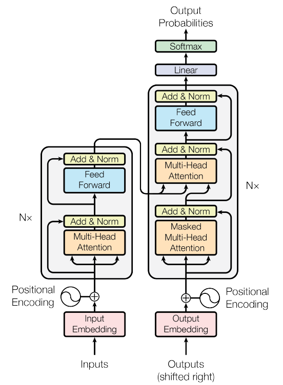
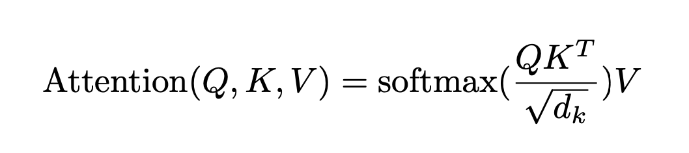
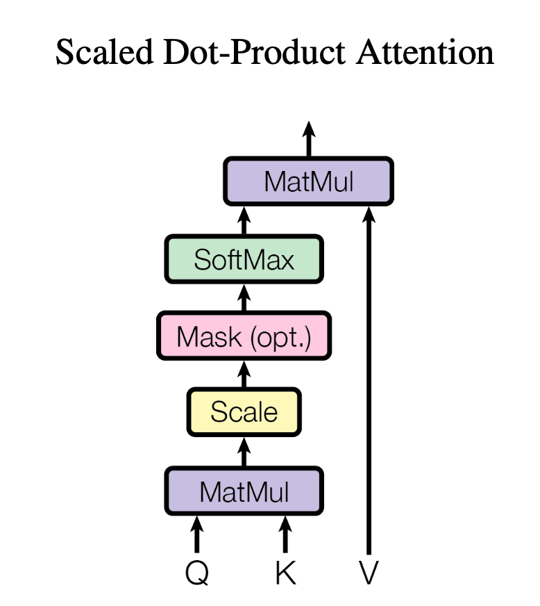
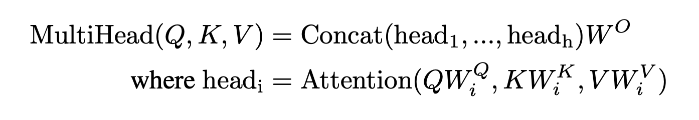

# Transformer

This repository contains my implementation of the transformer architecture proposed in the seminal paper "Attention is all you need" (you can find it here --> [Vaswani et al.](https://arxiv.org/abs/1706.03762)).



## Let's take a look at the components of a transformer:

### Embeddings and Softmax <br>
Transformer uses learned embeddings to convert the input tokens and output tokens to vectors of dimension d_model.
It also uses learned linear transformation and softmax function to convert decoder output to predict next-token probabilities.

It shares same weight matrix between the two embedding layers and the pre softmax linear transformation. In the embedding layers, we multiply those weights by sqrt(d_model)"

Explanation:
1. The embedding tensor before the encoder stack, the embedding tensor before the decoder stack, and the weight tensor of the linear layer that converts the final decoder vector into logits are the same tensor as all three tensors need to be of dimensions d_model x d_vocab and effectively perform the same function.
2. hen you extract a subword's embedding from the embedding tensor before the encoder or decoder stacks, just multiply it with d_model ^ 0.5 before adding it to the positional encoding.


### Positional Embeddings

Position embeddings are defined in paper as follows:


You can find the code to implement this and visualise in the file visualising_position_embeddings.py

**Visualising Positional encodings**


## Attention
I really enjoyed studying about attention. I ended up publishing my study notes in a blog here --> https://medium.com/@shubham.ksingh.cer14/understanding-attention-in-transformers-with-code-1ddd6c07abf4

Attention is described in paper like:


They hinted at implementation by providing following image:


Converting this image to functional code looks something like this:

```python
def scaled_dot_product_attention(query, key, value, mask=None, dropout=None):
    """
    Compute the scaled dot-product attention.
    """
    d_k = query.size(-1)  # Dimension of the key/query vectors

    # Compute the dot products
    # Assuming query and key have dimensions (batch_size, num_heads, sequence_length, d_k)
    scores = torch.einsum('bhqd,bhkd->bhqk', query, key) / d_k ** 0.5
    # Same as --> scores = torch.matmul(query, key.transpose(-2, -1)) / d_k ** 0.5
    # TO DO: compare and verify the outputs and update in the blog

    # Apply the mask (if provided)
    if mask is not None:
        scores = scores.masked_fill(mask == 0, float('-inf'))

    # Compute the attention weights/ attention pattern
    attention_weights = F.softmax(scores, dim=-1)

    if dropout is not None:
        attention_weights = dropout(attention_weights)

    # Compute the weighted sum of the values
    output = attention_weights @ value

    return output, attention_weights

```

## Multihead Attention
Paper describes multi head attention as follows:


Here is my implementation of Multi-head Attention layer.

```python
class MultiHeadAttentionImpl(nn.Module):
    def __init__(self, d_model, h, dropout = 0.1):
        super().__init__()

        self.h = h                  # number of heads, here h = 8, following naming convention from paper
        self.d_model = d_model      # Length of the sequence/sentence
        self.d_k = d_model // h     # naming as per the paper, d_model is nothing but embedding dimensions
        self.d_v = self.d_k         # Again, as per the paper, however, it's not necessary, some implementations can have d_k != d_v

        # Linear projections
        self.linear_q = nn.Linear(d_model, self.d_k * h)        # Wq, here d_model = d_k * h
        self.linear_k = nn.Linear(d_model, self.d_k * h)        # Wk
        self.linear_v = nn.Linear(d_model, self.d_v * h)        # Wv
        self.linear_out = nn.Linear(self.d_v * h, d_model)      # Wo

        self.dropout = nn.Dropout(dropout)

    def forward(self, query, key, value, mask=None):
        # query, key, value are 512 sequence vector which comes from either prev encoder or decoder
        # depending on this module is being used as self attention or cross attention
        # Expected shape (batch_size, seq_len, d_model)

        batch_size = query.size(0)         # Batch is the first dimension in our convention

        # Linear projections
        Q = self.linear_q(query)           # Q, K and V are batch_size x seq_len x d_model;
        K = self.linear_k(key)
        V = self.linear_v(value)

        # Split into multiple heads
        # Detailed explanation for this seemingly unintuitive block at the end of this file
        Q = Q.view(batch_size, -1, self.h, self.d_k).transpose(1, 2)      # Q, K and V are now (batch_size, sequence_length, self.num_heads, self.d_k)
        K = K.view(batch_size, -1, self.h, self.d_k).transpose(1, 2)
        V = V.view(batch_size, -1, self.h, self.d_v).transpose(1, 2)

        # Compute attention for each head
        output, attention_weights = scaled_dot_product_attention(Q, K, V, mask, self.dropout)

        # Concatenate heads
        output = output.transpose(1, 2).contiguous().view(batch_size, -1, self.d_v * self.h)
        # TO DO: Add and explanation

        # Final linear layer
        output = self.linear_out(output)
        return output
```

The layer calculates the attention as decribed in paper by this formula
